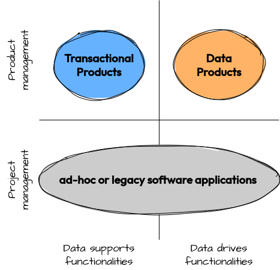
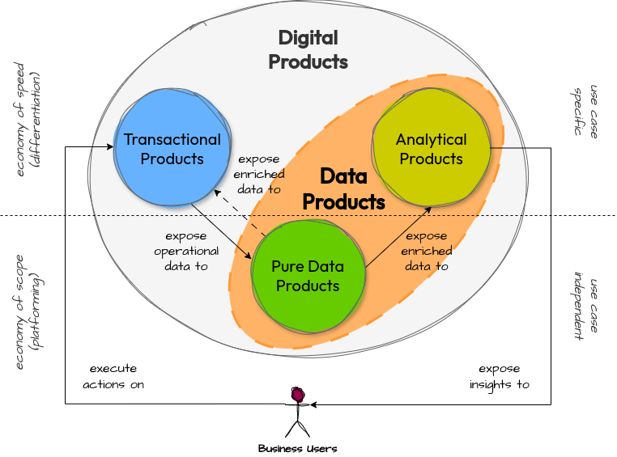
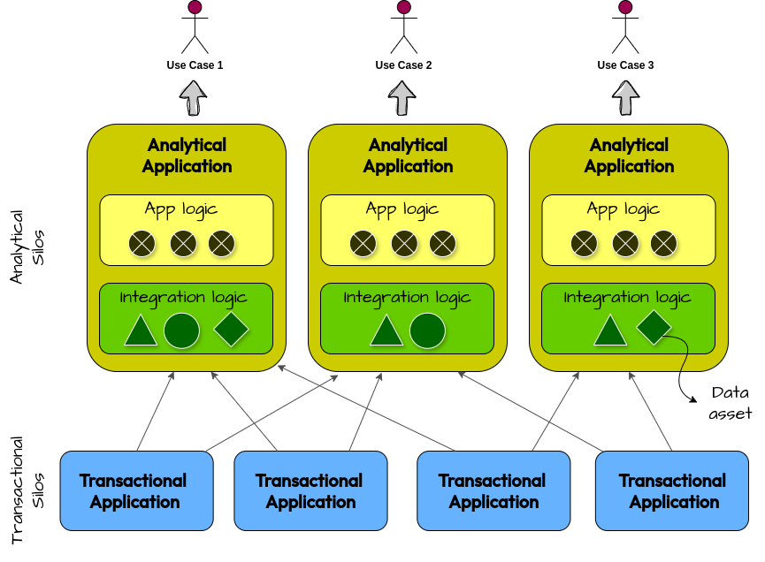
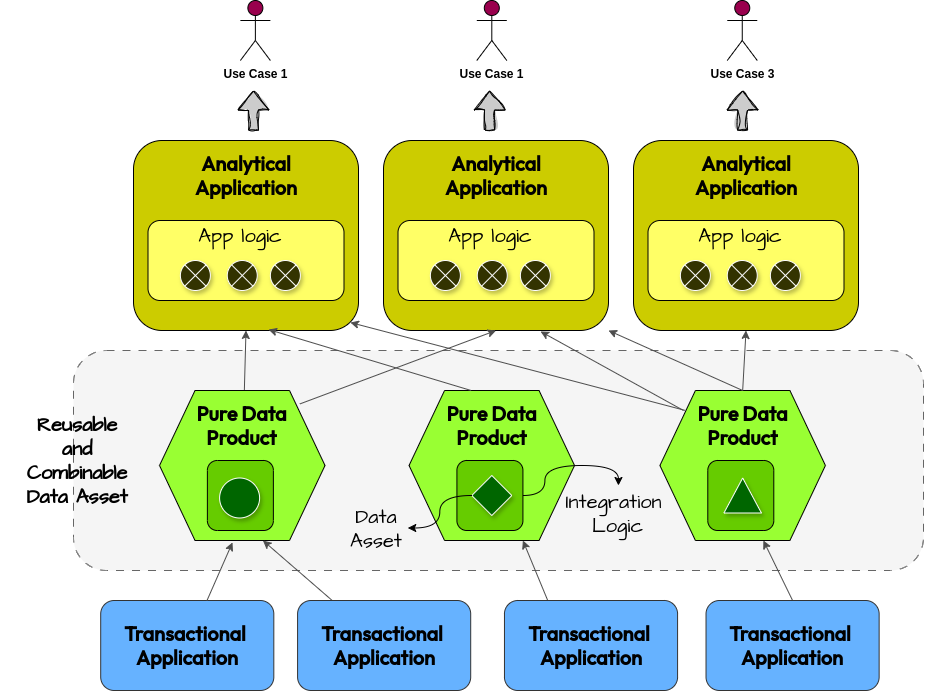
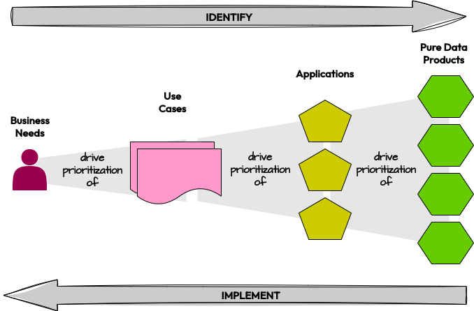
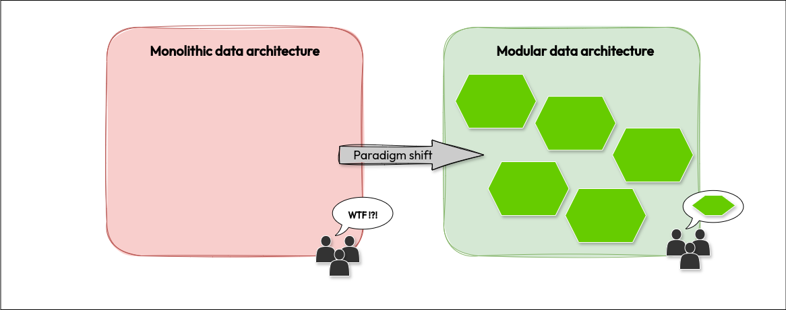

# What I Talk About When I Talk About Data Product

There’s a lot of buzz around data products these days, but no clear consensus on what the term actually means. As a result, it’s often used to describe entirely different things. Having just finished writing a book on how to manage data as a product, I’m thrilled to see the growing interest in the topic. But I also know the title *Managing Data as a Product* doesn’t give much away about what’s inside. Depending on how I define a data product, the 370 pages of the book might be exactly what you’re looking for — or completely off the mark. To save you the hassle of a potential Amazon return, let me use this blog post to explain what I talk about when I talk about data products.

(with apologies to [Evan Bottcher](https://martinfowler.com/articles/talk-about-platforms.html))

## Data Products Are Software Applications
For me, a data product is essentially a software application. Like any software, it’s a unit of management made up of interfaces, code, data, and infrastructure. A dataset on its own, even with clear ownership and published on a marketplace for easy consumption, isn’t a data product by itself.

However, not all software applications are data products. For an application to be considered a data product, it needs two key traits: it must be a product and offer functionalities directly driven by the data it manages. Let’s take a closer look at what these traits mean.

**A software application is a product when** it is developed following product management principles. Unlike applications built with a project-based approach, a product isn’t just about meeting a predefined set of requirements on time and budget (output). Instead, it focuses on solving a problem and delivering real value to users (outcome). Moreover, a product has an owner, and often a dedicated team, who drive its evolution over time, managing it through every stage of its lifecycle, from ideation to decommissioning.

**A software application is driven by data when** data isn’t just a by-product of its features but a key factor in shaping them. Transactional applications prioritize features, while the data they generate plays a secondary role. In contrast, a data product builds its features on top of the data it manages. Here, data comes first, driving the features and becoming a core part of the product.

To summarize, this is my definition of **data product**:

**A data product is a software application driven by data and developed following product management principles.**

## Is a dashboard a data product?
Based on this definition, dashboards and ML models are data products, right? If they are developed following product management principles, **my answer to this question is absolutely YES**. However, analytical applications such as dashboards and ML models are not the only possible type of data product. There are also data products that expose just data in its pure form, without building specific features on top of it, except for those necessary to facilitate management, access, and consumption. These pure data products are developed not to support a specific use case but to make a data asset easily reusable and composable with other data assets over time.

In my book Managing Data As A Product, I focus on this specific type of data pure products, exploring how to design a socio-technical architecture that supports their development and sustainable evolution over time. Here’s my definition of a pure data product:

*A **pure data product** is a **modular unit** within the data architecture, tailored to the cognitive capacity of the responsible team and developed following product management principles to make one or more data assets **accurate**, **relevant**, **combinable**, and readily **usable** for future value creation.*

## Why care about pure data products?
Data is an asset that only holds value when it is used. Pure data products don’t directly use the data but instead make it accessible to other analytical and non-analytical applications, facilitating its use. This raises the question: what’s the point of focusing on this type of data product? Isn’t it enough to develop analytical applications that address high-value use cases for the organization and end users?

**My answer to this question is a clear NO.** Without pure data products, each analytical application would have to reimplement all the necessary integrations to transform raw data into the correct format for developing its functionalities. As a result, every application becomes a data silo, where integration work — perhaps already done by other application applications— must be replicated from scratch, leading to obvious maintenance costs and the risk of misalignments.

The end user cares only about the result. They don’t mind whether an analytical application reimplements integration logic from scratch or relies on pure data products that can be reused in the future. In most cases, they will likely prefer the option that allows the analytical application to be implemented more quickly. When there is no existing portfolio of pure data products, the fastest option is always to implement ad-hoc integrations for the use case directly within the application, rather than developing pure data products first and then building the analytical application on top of them. However, in the medium term, this approach to implementing new use cases becomes unsustainable, due to high maintenance costs and data quality issues arising from multiple copies of the same data integrated with different logic by each analytical application.

Pure data products are a way to rationalize integration work related to key data assets within the organization, making them available to support multiple use cases. Pure data products are building blocks that allow data to be managed sustainably over time, controlling maintenance costs and ensuring quality.

Pure data products and analytical applications are equally important, and they don’t make sense without each other. As we’ve discussed, it’s not practical to have analytical applications without supporting pure data products (*engineering to order*), because the overall data architecture wouldn’t be sustainable in the long run. On the other hand, it also doesn’t make sense to have pure data products that don’t support any analytical applications (*stock to order*), since unused data is simply a non-productive cost. The right approach is to develop pure data products and analytical applications in tandem, following a use case-driven approach (*compose to order*).

## Is a pure data product truly a product?
Does it really make sense to call an application a product if it’s not directly used by business users? **My answer to this question is YES**. To be considered a product, an application needs users who recognize its value and may be willing to pay to use it. A DBMS is a product, just like a BI tool, even though the latter is used directly by the business while the former is not. Similarly, a pure data product is a product, just like an analytical application. The users may differ, but all the elements that define a product are there (ownership, lifecycle, users, etc.).

Moreover, a well-developed pure data product should make the data assets it manages as easy to understand, query, and use as possible, even for less technical users. A good pure data product should be usable by business users or even external customers.

## Is a DWH or a DATA LAKE a pure data product?
Pure data products act as a bridge between data producers and data consumers, creating a decoupling layer that allows integration work to be reused and shared. In essence, they do exactly what DWH and Data Lake have been doing for years. So, was it really necessary to introduce this new paradigm? Couldn’t a DWH and Data Lake simply be considered a pure data product?

**My answer to this question is NO**. It’s true that a DWH, or a Data Lake, is a software application that provides data in its pure form, but size also matters. As stated in the definition, ***a pure data product** is a **modular unit** within the data architecture, tailored to the **cognitive capacity** of the responsible team*.

DWHs and Data Lakes are typically monolithic applications, and their complexity quickly exceeds the cognitive capacity of the teams tasked with developing and maintaining them. This often leads to slower development and an accelerating growth of technical debt, until the system collapses under the weight of the complexity it created. It’s no coincidence that many organizations have had to rebuild their data platforms from scratch multiple times, following a *rip-and-replace* strategy. However, *replatforming* old systems replicating the same monolithic architecture has not solved the core issues related to sustainably managing the complexity generated.

Creating a modular platform allows this complexity to be broken down into smaller, more manageable parts that can be handled by the development team, or teams. This is why pure data products mustn’t be so big to exceed the cognitive capacity of the development team.

Data Lakes and DWHs are similar to monolithic transactional applications; they face the same problems in managing complexity. Instead, by leveraging the power of modularity, pure data products solve the problems of DWHs and Data Lakes, just as microservices solve the issues of monolithic transactional applications.

In the transactional world, developing monolithic applications today is considered an *antipattern*. So, why do we think we can solve the problems of Data Lakes and DWHs by simply implementing more Data Lakes and DWHs just changing underlying technologies?
Isn’t doing the same thing over and over again and expecting different results the definition of insanity?

## Ok, ok… but why invent a new term?
Since I divide data products into two categories — those that expose features built on data and those that simply provide features to make the managed data easily reusable — I needed to introduce two terms to clearly identify them. Was it necessary? Probably not, but without it, I’d have to repeat the definition whenever I need to distinguish between the two categories of data products. For simplicity and convenience, I use the terms pure data product and analytical product. Of course, there are better names, but what matters are the concepts, not the names. The names are just a way to refer to the concepts. If you find a better term, feel free to use it, as long as we’re aligned on the meaning :)

---

*And that’s all I have to say about what a data product is. If my definition resonates with you and you want to learn more about managing data as a product, please check out [my book](https://github.com/PacktPublishing/Managing-Data-as-a-Product/tree/main) or follow me on [LinkedIn](https://www.linkedin.com/in/andreagioia/).*

