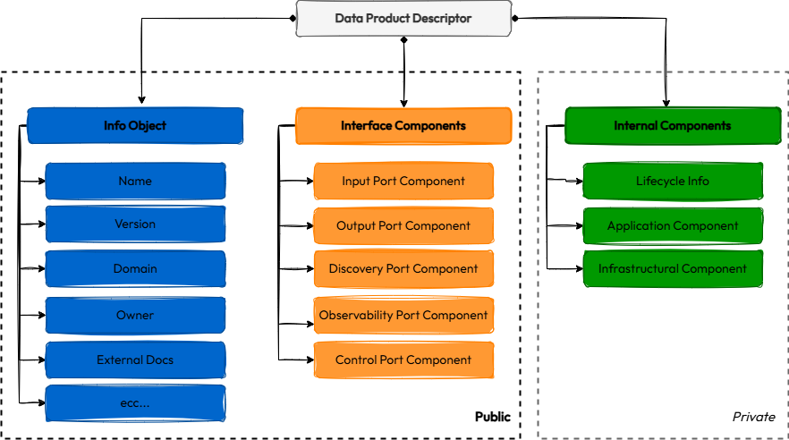

# Data Contract vs. Data Product Specifications: Friends, Enemies, or Frenemies?
- *10 min read - Published on Feb 9, 2025 by [Andrea Gioia](https://github.com/andrea-gioia) on [Medium](https://medium.com/@andrea_gioia/data-contract-vs-data-product-specifications-8ffa3cc16725)*

---

With the rise of **data mesh**, managing **data as a product** has become a hot topic within the data community. This shift has sparked numerous initiatives to define a common specification for formally describing data assets managed as products.

However, not all specifications approach this in the same way. Some focus primarily on the **data asset itself**, detailing its structure and metadata. Others take a broader perspective, describing the **data product as a whole**, including its exposed services (i.e. **ports**) and internal components.

These two approaches have led to two distinct types of specifications:

- **Data Contract Specifications**, which focus on defining the structure of a data asset and all associated metadata.
- **Data Product Specifications**, which focus on defining how a data product manages, exposes, and serves its data assets.

In this blog post, I will explore both perspectives using two key examples:

- **[The Open Data Contract Standard (ODCS)](https://bitol-io.github.io/open-data-contract-standard/latest/)** from the [Bitol Project](https://bitol.io/) as an example of a data contract specification.
- **[The Data Product Descriptor Specification (DPDS)](https://dpds.opendatamesh.org/specifications/dpds/1.0.0/)** from the [Open Data Mesh Initiative](https://initiative.opendatamesh.org/) as an example of a data product specification.

By comparing these two approaches, I’ll show why they are **not mutually** exclusive but can work **best when used together**.

---
## What makes them different

A **pure data product** is a software application that focuses on exposing data assets to potential consumers in a way that ensures their **relevance**, **accuracy**, **usability**, and **composability** over time. In summary, pure data products aim to increase the potential value of managed data assets by making them available for the implementation of multiple use cases over time.


A pure data product manages and makes one or more data assets available for use. **Data Contract Specifications (DCS)** focus on defining how to describe the data assets being shared, while **Data Product Specifications (DPS)** focus on how to describe the data products that handle and expose those assets.


A DCS can be used to describe a **data asset** from multiple perspectives, including:

- The data model
- Constraints applied to different elements of the model
- Quality metrics and corresponding tests
- Quality indicators with associated SLOs/SALs
- Data provenance and static lineage tracking
- Links to other data assets (syntactic links)
- Connections to business terms or concepts (semantic links)

  A DPS, on the other hand, can be used to describe a **pure data product** from multiple perspectives, including:

- Types of exposed services (ports)
- APIs of the exposed services
- Applicable SLOs/SLAs for the services
- Terms of use
- Billing policies for service usage
- Internal application components
- Internal infrastructure components
- Lifecycle management
- Dependencies between products

To better understand the structure and practical applications of DPS e DCS, let’s explore two concrete examples, analyzing them separately before examining their overlaps and potential integrations.

## Open Data Contract Standard

**Open Data Contract Standard (ODCS)** is a well-known example of a Data Contract Standard (DCS) developed by the [Bitol Project](https://bitol.io/).


In ODCS’s [metamodel], a data asset is represented as an **object** with various **properties**. Each property has a **unique name** within its object and a defined **data type**. The type can be either primitive (e.g., `int`, `string`, `boolean`) or composite (e.g., `object` or `array`).

Thanks to this flexible structure, ODCS can describe both **tabular data assets** — where entries consist solely of primitive types — and **document-based data assets**, where entries can include composite types, creating a nested structure instead of a simple flat one.

To define the structure of a specific data asset, ODCS uses [JSON Schema](https://github.com/bitol-io/open-data-contract-standard/blob/main/schema/odcs-json-schema-latest.json) as its schema definition language (SCD) preferring YAML over JSON as the encoding format.

```yaml
version: 1.0.0

schema:
  - name: tbl
    logicalType: object
    properties:
      - name: txn_ref_dt
        logicalType: date
      - name: rcvr_id
        logicalType: string
      - name: rcvr_cntry_code
        logicalType: string
```

Structural elements of the model can be enriched with various descriptive metadata, grouped into the following ten main schema annotation vocabularies:

- **Fundamentals** (e.g., name, version, descriptions…)
- **Schema** (logical and physical metadata)
- **Data Quality** (data quality rules and data governance policies)
- **Pricing** (internal or external costs associated with usage)
- **Team** (history of team members)
- **Security** (roles)
- **SLA** (latency, retention, frequency…)
- **Infrastructure** (servers, environment, and storage)
- **Business Rules** (data QoS applied to specific business needs)
- **Custom** (space for custom needs)

A data contract instance in ODCS is therefore the combination of the structural description of the data asset along with all the relevant metadata needed for its management and usage.


Here you can find a [complete example of a data contract instance](https://bitol-io.github.io/open-data-contract-standard/latest/examples/all/full-example.odcs.yaml) compliant with the ODCS.

## Data Product Descriptor Specification

**Data Product Descriptor Specification (DPDS)** is a well-known example of a Data Product Specification (DPS) developed by the [Open Data Mesh Initiative](https://initiative.opendatamesh.org/).


Since there is no single, universally accepted definition of a data product, all existing DPSs take an opinionated approach to how a data product should be structured and what its key components are. That said, the main DPSs currently available largely align with the concept of pure data products, where each product is made up of interfaces, often grouped into ports, and internal components, typically divided into application and infrastructural components.


DPDS follows this vision of data product structure in defining its metamodel, which is illustrated at a high level in the following image.



Specifically, the DPDS metamodel describes a data product through a descriptor object that is composed of

1. one object that contains all general information about the data product (**Info Object**),
1. six types of ports (**Input, Output, Discoverability, Observability, and Control Ports**),
1. three types of internal components (**Lifecycle Info, Application Components, and Infrastructural Components**).

To define the structure of a specific data product, DPDS uses [JSON Schema](https://dpds.opendatamesh.org/specifications/dpds/1.0.0/schema/) as its schema definition language (SCD) accepting both YAML and JSON as encoding formats. 

```json
{
    "dataProductDescriptor": "1.0.0",

    "info": {
        "name": "tripExecution",
        "fqn": "urn:dpds:com.company-xyz:dataproducts:tripExecution:1"
    },

    "interfaceComponents": {
      "inputPorts": [{
        "name": "transportManagementSystem"
        "fqn": "urn:dpds:com.company-xyz:dataproducts:tripExecution:1:outputports:transportManagementSystem",
      }]
      "outputPorts": [{
        "name": "tripStatus",
        "fqn": "urn:dpds:com.company-xyz:dataproducts:tripExecution:1:outputports:tripStatus",
      }]
   },

   "internalComponents": {
     "applicationComponents": [{
       "name": "cdcIngestionApp",
       "fqn": "urn:dpds:com.company-xyz:dataproducts:tripExecution:1:applications:cdcIngestionApp",
     },{
       "name": "eventProcessorApp",
       "fqn": "urn:dpds:com.company-xyz:dataproducts:tripExecution:1:applications:eventProcessorApp",
     }{
       "name": "dbSinkConnectorApp",
       "fqn": "urn:dpds:com.company-xyz:dataproducts:tripExecution:1:applications:dbSinkConnectorApp",
     }],
     "infrastructuralComponents": [{
       "name": "eventStore",
       "fqn": "urn:dpds:com.company-xyz:dataproducts:tripExecution:1:infrastructure:eventStore",
     },{
       "name": "stateStore",
       "fqn": "urn:dpds:com.company-xyz:dataproducts:tripExecution:1:infrastructure:stateStore",
     }]
  }
}
```

Like ODCS, DPDS not only defines the structure of the object of interest — in this case, a data product — but also allows for enriching it with additional metadata. To achieve this, keywords used for annotation are organized into vocabularies, grouping them based on function or the element they describe (e.g., *API, SLO, usage, contact points,* etc.).

In DPDS, each component of a data product has its dedicated vocabulary or set of associated vocabularies. For instance, every port, regardless of its specific type, can be annotated using keywords defined in one of the following three vocabularies:

1. **Promises:** Contains all the keywords useful for specifying the intent of the port. Promises are not a guarantee of the outcome but the data product will behave accordingly to them to realize its intent. Examples of annotations defined in promises vocabulary are *API, SLO, deprecation policy, etc*.
    
1. **Expectations:** Contains all the keywords useful to specify how the port should be used by consumers. They are a way to explicitly state what promises the data product would like consumers to make regarding how they will use the port. Examples of annotations defined in expectations vocabulary are *intended usage, intended audience, etc.*

1. **Obligations:** Contains all the keywords useful to specify promises and expectations that must be respected both by the data product and its consumers respectively. An obligation is an explicit agreement between the data product and its consumers. It is used to group all the promises and expectations that if not respected can generate penalties like monetary sanctions or interruption of service. Examples of annotations defined in obligations vacabulary are *terms of conditions, SLA, billing policy, etc.*

Here you can find a [complete example](https://github.com/opendatamesh-initiative/odm-specification-dpdescriptor/tree/main/examples/tripexecution) of a data product described using DPDS.

## Common overlaps
Since, in managing the data-as-a-product paradigm, data assets and data products are closely related, it is natural for the two types of specifications to have some overlaps, even though their primary focus is on describing different objects.


For example, both types of specifications include general information about the described object, which applies whether the object is a data asset or a data product (e.g., *description, ownership, contact channels, purpose, external documentation, tags, etc.*).

Furthermore, in DCS, making a data asset accessible and consumable requires specifying the serving system and its API. This block of metadata naturally overlaps with the definition of output ports in a DPS.

Similarly, in a DPS, making exposed data assets truly consumable requires more than just describing the access APIs; it also involves defining the schema of the data assets they expose. This creates potential overlaps with the data asset structure and annotations described within DCS.

## Integration points
Despite potential overlaps, the two types of specifications can be used in a fully complementary way. A DPS can be used to define the structure of a data product while a DCS can be used to describe the structure of the data assets exposed through its output ports.

For example, in DPDS, most structural components of a data product can be extended with [custom properties](https://dpds.opendatamesh.org/specifications/dpds/1.0.0/#specification-extensions). This allows each port element to include a custom property called `x-dataContract`, which serves as a reference to the definition of the data contract in use.

The value of the property `x-dataContract` can be a simple string containing the identifier of the referred data contract like in the following example or a **[Standard Definition Component](https://dpds.opendatamesh.org/specifications/dpds/1.0.0/#standard-definition-component)**.

```json
{
  "dataProductDescriptor": "1.0.0",

  "info": {
    "name": "tripExecution",
    "fqn": "urn:dpds:com.company-xyz:dataproducts:tripExecution:1"
  },

  "outputPorts": [{
    "name": "tripStatus",
    "fqn": "urn:dpds:com.company-xyz:dataproducts:tripExecution:1:outputports:tripStatus",

    "promises": {
      "api": {
        "specification": "datastoreapi",
        "specificationVersion": "1.0.0",
        "definition": {
          "mediaType": "text/json",
            "$ref": "trip-status-oport-api.json"
          }
      },
  
      "x-dataContract": "53581432-6c55-4ba2-a65f-72344a91553a"
    }
  }]
}
```

In DPDS, **Standard Definition Components** are used to incorporate component definitions based on external specifications. For instance, port APIs are always defined using **Standard Definition Components**, enabling them to be described using external API specifications such as OpenAPI, AsyncAPI, or DatastoreAPI.

Through the `x-dataContract` custom property of type **Standard Definition Components**, it’s possible to include in the data product descriptor an external DCS and use it to define the data contract for the port. The following is an example of an output port defined in DPDS, with its data contract specified using ODCS.

```json
{
  "dataProductDescriptor": "1.0.0",

  "info": {
    "name": "tripExecution",
    "fqn": "urn:dpds:com.company-xyz:dataproducts:tripExecution:1"
  },

  "outputPorts": [{
    "name": "tripStatus",
    "fqn": "urn:dpds:com.company-xyz:dataproducts:tripExecution:1:outputports:tripStatus",
    
  "promises": {
      "api": {
        "specification": "datastoreapi",
        "specificationVersion": "1.0.0",
        "definition": {
          "mediaType": "text/json",
            "$ref": "trip-status-oport-api.json"
          }
      },
  
      "x-dataContract": {
        "specification": "odcs",
        "specificationVersion": "3.0.0",
        "definition": {
          "mediaType": "text/yaml",
            "$ref": "trip-status-oport-contract.yaml"
          }
      }
    }
  }]
}
```

The same approach applies to ODCS, where the [`customProperties`](https://bitol-io.github.io/open-data-contract-standard/latest/#custom-properties) object can be used to specify the fully qualified name of the output port within a data product — defined using DPDS — that exposes the data asset governed by the data contract.

```json
version: 1.0.0

schema:
  - name: trip_status
    logicalType: object
    properties:
      - name: id
        logicalType: integer
      - name: status
        logicalType: string
      - name: position
        logicalType: string
      - name: last_status_update
        logicalType: date

 customProperties:
 servedBy: urn:dpds:com.company-xyz:dataproducts:tripExecution:1:outputports:tripStatus
```

## Wrapping up

The term data contract refers to all agreements between a data producer and its consumers. In theory, it can be used to describe both agreements related to the data asset being exchanged and those related to the data product that manages and delivers the data asset.

However, in practice, the specifications that have emerged in recent years have become quite polarized, with some focusing on describing the data asset (i.e. data contract specification) and others on describing the data product that delivers the data asset (i.e. data product specification). We’ve specifically explored ODCS as an example of the first type of specification and DPDS as an example of the second.

Despite some overlap between these two types of specifications, both are extremely valuable in a modular and potentially distributed data solution for governing how data is exchanged, used, and composed within the ecosystem.

We’ve seen in this post how to use them complementarily — leveraging DPS to describe a data product and DCS to define the agreements on its output ports.


In my view, this separation of concerns between the two specifications allows each to be used to its fullest potential, taking advantage of their unique features while avoiding unnecessary overlap.

Using them together also helps prevent the creation of monolithic specifications that try to cover all aspects of data management, promoting instead the development of smaller, more focused specifications that can be easily composed in various ways depending on the needs of each specific context. I’ll dive deeper into the topic of specification composability and how it can help with the adoption and standardization process in the next post.

Thanks for reading this far! I’m eager to hear your thoughts on DPS and DCS: are they enemies, friends, or frenemies?

---
## Resources

This blog post is part of a series focused on data specifications. Here are the other posts in the series:

1. [How to Define Internal Data Specifications to Govern Your Data Ecosystem](https://github.com/andrea-gioia/TheDataJoy/tree/main/blogs/2025/b001-how-to-define-internal-data-specifications)
1. Data Contract vs Data Product Specifications (this post)
1. *Composable Data Specifications (coming soon…)*

Other resources…

📙For a deeper understanding of data contracts, I recommend [“Driving Data Quality with Data Contracts”](https://a.co/d/fWBxJqU) by **Andrew Jones**.

📙Instead, to learn how to apply data contracts specifically within the data mesh paradigm, check out [“Implementing Data Mesh”](https://a.co/d/9tnI7h4) by **Jean-Georges Perrin** and **Eric Broda**.

📙Finally, if you’re interested in exploring pure data products, feel free to refer to my book, [“Managing Data as a Product”](https://a.co/d/0Qgawux) 😀
