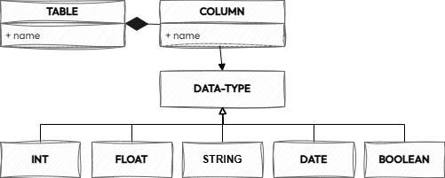

# How to Define Internal Data Specifications to Govern Your Data Ecosystem: Hands-on Guide
*Published on Feb 2, 2025 by [Andrea Gioia](https://github.com/andrea-gioia) on [Medium](https://medium.com/@andrea_gioia/how-to-define-internal-data-specifications-to-govern-your-data-ecosystem-9d59b3473dfe)*

In the world of data, we have plenty of specifications — but surprisingly few standards. SQL is one of the rare success stories, a standard that has saved countless resources over the years thanks to its interoperability. But beyond SQL, widely adopted standards are scarce, and this gap poses a major challenge for the entire ecosystem.

Why is this happening? And what can we do to change it? In my next post, I’ll explore ways to foster new standards in the data space. But first, let’s take a step back. What makes a good data specification? And how can you build one from scratch within your organization? In this post, I’ll break down the key elements of an effective specification and share practical steps to create one.

---

## What Is a Specification Anyway?

A specification is a formal and unambiguous description of an entity of interest, either an object or a process, that provides all and only the necessary information for its design, development, and/or operational use.

A **specification** can be either public or private. A **public specification** is considered **open** when its evolution isn’t controlled by a single organization but is shaped by multiple organizations through clear and inclusive governance rules.

A **standard** is an open specification that multiple organizations within a shared ecosystem widely adopt. It is typically recognized by a standardization body that oversees its evolution through a collaborative and transparent process.


## Why Internal Data Specifications Matter

Data specifications are fundamental to ensuring that a data solution or data product is built correctly, meets expectations, and remains easy to use and maintain over time. In many ways, they represent the highest form of **global governance policies**.

Their importance grows in complex data ecosystems where multiple independent entities operate in a distributed manner, often with different — or even conflicting — goals. In these environments, shared specifications serve as the **rules of the game**, imposing certain constraints on individual actors in exchange for smoother collaboration and a more sustainable evolution of the entire data ecosystem.

Even without widely accepted **data standards**, defining **internal data specifications** can be highly valuable for an organization looking to govern its **data ecosystem** — especially when adopting a **data-as-a-product** paradigm or embracing **data mesh** principles.


## How to Get Started

When defining an internal specification, the first step is to clearly understand what you are describing and why it needs to be defined. Once that’s established, the next step is determining who should be involved in the process.

Internal specifications are best developed in a **collaborative**, **federated approach**, actively involving representatives from all impacted groups rather than imposing them from the top down. Even within an organization, a specification only makes sense if it is actually used — and the best way to ensure adoption is to engage stakeholders in its creation.

Defining an internal specification doesn’t always mean starting from scratch — in fact, quite the opposite. Once the **what** and **why** are clear, it’s crucial to carefully consider the **how**. This involves assessing whether existing external specifications already meet the identified requirements. While no external specification will perfectly fit every organization’s needs, it’s important to weigh the **trade-offs** between adapting an existing one and building a new specification from the ground up.

Once a shared decision is reached, it should be documented for future reference through a **governance decision record**.

If there are strong reasons not to reuse an existing specification, it’s time to move forward with designing an internal **custom specification**. Let’s explore how.

## Designing Your Own Data Specification
Specifications can be broadly categorized into two types, depending on the entity being described: **object specifications** and **protocol specifications**.

An **object specification** outlines the attributes, properties, behaviors, and constraints of an object (ex. [Data Product Descriptor Specification](https://dpds.opendatamesh.org/)). A **protocol specification**, on the other hand, defines the rules and formats that different actors must follow to communicate with one another (ex. [Open Telemetry Protocol](https://opentelemetry.io/docs/specs/otel/protocol/)).

In short, **object specifications** describe the components of a system, while **protocol specifications** explain how these components interact.

In this blog post, we’ll focus on defining an **object specification** in the data context. Object specifications are simpler, something I’m quite familiar with from writing several of them, and they often serve as the foundation for more complex **protocol specifications**.

An object specification should clearly and unambiguously define how to describe the object of interest. In my experience, this can be achieved by defining the following three key elements in the specification:

🗺️ A Metamodel

📜 A Schema Definition Language (SDL)

📚 Schema Annotation Vocabularies

Let’s take a closer look at each of these.

### 🗺️ A Metamodel
A **metamodel** is a model that defines the structure, rules, and constraints for creating other models. It serves as a blueprint to outline the basic structure of the object the specification is intended to describe.

Here is a simple metamodel that could be used in a specification designed to describe data assets with a tabular structure.



As shown in the image, a tabular data asset can be modeled using a Table object, which has a name and a list of Column objects. Each Column object has a name and a data type, which can be one of the following: `BOOLEAN`, `INT`, `FLOAT`, `STRING`, or `DATE`.

### 📜 A Schema Definition Language (SDL)
A **Schema Definition Language (SDL)** is a formal language used to describe a model that is an instance of a specific metamodel. In other words, the metamodel defines what can be described at a conceptual level, while the SDL provides practical guidelines for how to describe it.

The following is an example of a BNF definition for an SDL that can be used to describe an instance of the metamodel for tabular data assets presented in the previous section.

```
<table_definition> ::= "TABLE" <table_name> "{" <column_definitions> "}" 

<column_definitions> ::= <column_definition> | <column_definition> "," <column_definitions> 

<column_definition> ::= <column_name> <data_type>

<data_type> ::= "INT" | "FLOAT" | "STRING" | "DATE" | "BOOLEAN" 

<table_name> ::= <identifier> 
<column_name> ::= <identifier> 

<identifier> ::= <letter> <identifier_tail> 
<identifier_tail> ::= <letter_or_digit> <identifier_tail> | ε 
<letter_or_digit> ::= <letter> | <digit> 
<letter> ::= "a" | "b" | ... | "z" | "A" | "B" | ... | "Z" | "_" 
<digit> ::= "0" | "1" | ... | "9"
```

The following is an example of a valid model instance described using the SDL defined above.

```
TABLE Employees {
    EmployeeID INT,
    FirstName STRING,
    LastName STRING,
    Salary FLOAT,
    DepartmentID INT
}
```

Most specifications don’t define their own SDL but instead reuse an existing one that is expressive enough to describe instances of the metamodel adopted by the specification. **JSON Schema** is one of the most widely used SDLs for this purpose, thanks to its expressiveness, ease of use, and the wide range of supporting tools available. The following is an example of a JSON Schema that can be used to describe instances of the metamodel introduced earlier for tabular data assets.

```json
{
  "$schema": "http://json-schema.org/draft-07/schema#",
  "type": "object",
  "properties": {
  "djs": {
      "type": "string"
    },
    "name": {
      "type": "string",
      "pattern": "^[a-zA-Z_][a-zA-Z0-9_]*$"
    },
    "columns": {
      "type": "array",
      "minItems": 1,
      "items": {
        "type": "object",
        "properties": {
          "name": {
            "type": "string",
            "pattern": "^[a-zA-Z_][a-zA-Z0-9_]*$"
          },
          "type": {
            "datatype": "string",
            "enum": ["INT", "FLOAT", "STRING", "DATE", "BOOLEAN"]
          }
        },
        "required": ["name", "type"],
        "additionalProperties": false
      }
    }
  },
  "required": ["djs", "name", "columns"],
  "additionalProperties": false
}
```

The following is an example of a valid model instance described using the metamodel defined above and formally described using the previous JSON schema.

```json
{
  "djs": "1.0.0",

  "name": "Employees",
  
  "columns": [
    {
      "name": "EmployeeID",
      "datatype": "INT"
    },
    {
      "name": "FirstName",
      "datatype": "STRING"
    },
    {
      "name": "LastName",
      "datatype": "STRING"
    },
    {
      "name": "Salary",
      "datatype": "FLOAT"
    },
    {
      "name": "DepartmentID",
      "datatype": "INT"
    }
  ]
}
```

A JSON schema can also be used to validate model instances written in YAML. The following YAML instance of the metamodel, for example, is equivalent to the previous one in JSON.

```yaml
djs: 1.0.0
name: Employees
columns:
  - name: EmployeeID
    datatype: INT
  - name: FirstName
    datatype: STRING
  - name: LastName
    datatype: STRING
  - name: Salary
    datatype: FLOAT
  - name: DepartmentID
    datatype: INT
```

### 📚 Schema Annotation Vocabularies
An **annotation** is a property that adds additional information to a model element. Each annotation consists of a keyword and an associated value. The **keyword** defines the meaning of the **value** used to enrich the annotated model component. The metamodel specifies which components can be annotated, while the SDL defines how to add the annotations.

The following example demonstrates how to extend the SDL defined earlier in BNF to enable annotation of the **TABLE** and **COLUMN** elements of the metamodel.

```
<table_definition> ::= "TABLE" <table_name> <annotations> "{" <column_definitions> "}"

<column_definitions> ::= <column_definition> | <column_definition> "," <column_definitions>

<column_definition> ::= <column_name> <data_type> <annotations>

<annotations> ::= "[" <annotation_list> "]" | ε

<annotation_list> ::= <annotation> | <annotation> "," <annotation_list>

<annotation> ::= <annotation_key> "=" <annotation_value>

<annotation_key> ::= <identifier>
<annotation_value> ::= <string_literal> | <number_literal>

<data_type> ::= "INT" | "FLOAT" | "STRING" | "DATE" | "BOOLEAN"

<table_name> ::= <identifier>
<column_name> ::= <identifier>

<identifier> ::= <letter> <identifier_tail>
<identifier_tail> ::= <letter_or_digit> <identifier_tail> | ε
<letter_or_digit> ::= <letter> | <digit>
<letter> ::= "a" | "b" | ... | "z" | "A" | "B" | ... | "Z" | "_"
<digit> ::= "0" | "1" | ... | "9"

<string_literal> ::= '"' <string_content> '"'
<string_content> ::= <character> <string_content> | ε
<character> ::= <letter> | <digit> | " " | "_" | "-" | "." | ":" | "/"

<number_literal> ::= <digit> | <digit> <number_literal>
```

This is an example of an instance of the metamodel defined using the custom SDL based on the above BNF syntax, where each element is enriched with various annotations.

```
TABLE Employees [database="hr", phisycalName="EMPL"] {
    EmployeeID INT [phisycalName="ID", primaryKey="true"],
    FirstName STRING [phisycalName="FNAME"],
    LastName STRING [phisycalName="LNAME"],
    Salary FLOAT [phisycalName="SALARY"],
    DepartmentID INT [phisycalName="DEPID"]
}
```

In JSON Schema, any keyword not used for validating the structure of a model instance is automatically treated as an annotation. Therefore, there’s no need to extend the schema to annotate its instances, as demonstrated in the following instance example.

```json
{
  "djs": "1.0.0",

  "name": "Employees",
  "database": "hr",
  "physicalName": "EMPL",
  "columns": [
    {
      "name": "EmployeeID",
      "datatype": "INT",
      "physicalName": "ID",
      "primaryKey": "true"
    },
    {
      "name": "FirstName",
      "datatype": "STRING",
      "physicalName": "FNAME"
    },
    {
      "name": "LastName",
      "datatype": "STRING",
      "physicalName": "LNAME"
    },
    {
      "name": "Salary",
      "datatype": "FLOAT",
      "physicalName": "SALARY"
    },
    {
      "name": "DepartmentID",
      "datatype": "INT",
      "physicalName": "DEPID"
    }
  ]
}
```

Thanks to annotation, it is possible to clearly separate what in the description of the object of interest is structural and what is a descriptive property. By doing this, it becomes possible to describe the same object from multiple viewpoints. This makes the specification more flexible, easier to extend, and compatible with other specifications. It is probably the most important takeaway I have learned from writing specifications in the past couple of years.

To use annotations effectively, the specification must not only define the metamodel and the SDL to describe it but also outline the allowable annotations and their definitions. Typically, the set of keywords used to annotate a model instance, along with their domain, range, and descriptions, is called a **vocabulary**.

A specification may group annotations into different vocabularies based on their type. For example, the annotations used in the previous example could be logically organized into a vocabulary that defines all the keywords related to the physical system used to store and access the data asset.

A vocabulary can be specified in various forms. In general, it should always include, for each keyword, its meaning (description), the type of accepted value (range), and the list of model elements to which it can be applied within the model instance (domain). Below is an example of a vocabulary that defines the keywords used earlier.

```json
{
  "vocabulary": "meta-physical",
  "keywords": {
    "physicalName": {
      "domain": ["TABLE","COLUMN"],
      "range": ["string"],
      "description": "The name of the element in the source datastore."
    },
    "physicalType": {
      "scope": ["TABLE","COLUMN"],
      "range": [
        "string"
      ],
      "description": "The type of the element in the source datastore. For table object MAY be equal to TABLE, VIEW, etc ... For column object MAY be equal to VARCHAR, TINNYINT, etc..."
    },
    "partitionKey": {
      "domain": ["COLUMN"],
      "range": ["boolean"],
      "description": "When set to true, the partitionKey keyword indicates that the property is part of the dataset's partition key.",
      "default": false
    }
  }
}
```

## Putting all together

Once the metamodel, SDL, and supported schema annotation vocabularies are defined, the specification is ready. At this point, you can collect everything into a Git repository and release the first version.

It’s generally helpful to have a [single normative document](https://github.com/andrea-gioia/the-data-joy-spec/blob/main/versions/1.0.0.md) that describes the specification. This document should include a detailed description of the [metamodel](https://github.com/andrea-gioia/the-data-joy-spec/blob/main/versions/1.0.0.md#%EF%B8%8F-metamodel), the [schema definition language](https://github.com/andrea-gioia/the-data-joy-spec/blob/main/versions/1.0.0.md#-schema) used to describe its instances, and supported [vocabularies](https://github.com/andrea-gioia/the-data-joy-spec/blob/main/versions/1.0.0.md#-annotations-vocabularies) for annotating the structure.

Along with this document, it’s useful to share the [SDL definition](https://github.com/andrea-gioia/the-data-joy-spec/blob/main/schemas/1.0.0/schema.json) and [examples](https://github.com/andrea-gioia/the-data-joy-spec/tree/main/examples/1.0.0). Additional documentation, such as a [quickstart guide](https://github.com/andrea-gioia/the-data-joy-spec/blob/main/docs/quickstart.md) or an explanation of the core concepts the specification is based on, can also be valuable.

At [this link](https://github.com/andrea-gioia/the-data-joy-spec), you’ll find the repository used to publish and manage the evolution of the sample specification we have defined together so far.

Now it’s your turn — happy specifying! :)
