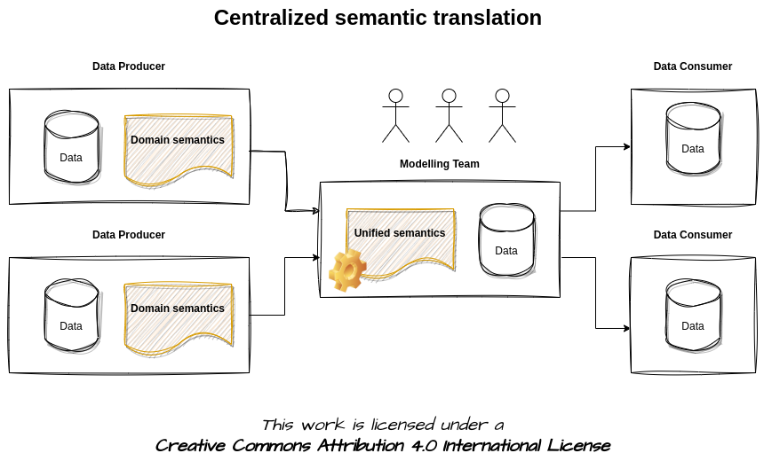

# Semantic Translation

## Post

🤔 Data product semantics: one, none, or a hundred thousand?

🥇 The semantics of data is undoubtedly one of the most crucial pieces of metadata that one inevitably has to manage sooner or later. Ultimately, nobody chooses to use a dataset because it adheres to a specific schema or is provided by a particular service. A dataset is utilized in accordance with the business concepts to which it is linked, that is, based on its semantics.

💥 Traditional monolithic data architectures ensure unified data semantics by design. But what about semantics in distributed data architectures like the **datamesh**? Modularization often leads to fragmented semantics, at least one for domains, making life complex for data consumers. 

🤓 Various approaches exist to tackle this translation problem...

1️⃣ Decentralized semantic translation: 
The task of reconciling different semantics is left to each individual consumer

2️⃣ Centralized semantic translation: 
The task of defining a unified semantic model and reconciling the various semantics used by domains is assigned to a dedicated central team

3️⃣ Federated semantic translation: 
The task of defining a unified semantic model is assigned to a dedicated central team but the task of translating domain semantics into the semantics of the unified model is distributed across data product teams.

Which approach do you usually follow? 1️⃣, 2️⃣, 3️⃣ , or something else?

[#TheDataJoy](https://www.linkedin.com/feed/hashtag/?keywords=thedatajoy) **#dataproducts #semantic #datamesh** 

## Image

[draw.io](https://app.diagrams.net/) source of the image is available [here](../images/002-semantic-translation-decentralized.drawio) 

[draw.io](https://app.diagrams.net/) source of the image is available [here](../images/003-semantic-translation-centralized.drawio)

[draw.io](https://app.diagrams.net/) source of the image is available [here](../images/004-semantic-translation-federated.drawio) 

## Follow the conversation

🔵 [Linkedin post](https://www.linkedin.com/posts/andreagioia_approaches-to-semantic-translation-activity-7109130116558970880-MqUz)
