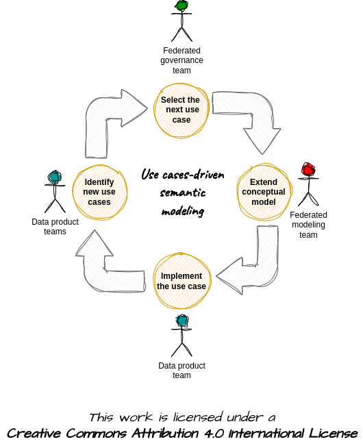

# Use cases-driven semantic modeling

## Post
Use cases-driven semantic modeling...

Regardless of whether the approach taken for semantic modeling is centralized, decentralized, or federated, it is crucial that modeling activities are carried out in a lean manner, always maintaining a strong alignment with real use cases.

Here are the key steps to follow to prevent the development of oversized or misaligned models in relation to actual needs:

📍 Map out the use cases requiring semantic modeling, especially those involving data processing across different domains with varying semantics

📍 Prioritize the gathered use cases based on their impact on shared business success indicators and their feasibility

📍Identify the concepts and the level of detail in their definition necessary to support the highest-priority use cases

📍 Define the identified concepts if they are not already present in the existing model

📍Classify the data of interest based on the new concepts (semantic linking)

📍 Implement the use cases and validate the newly introduced concepts.

🚩 Repeat the cycle, starting anew from step one

[#TheDataJoy](https://www.linkedin.com/feed/hashtag/?keywords=thedatajoy) **#datamodeling #semanticmodeling #dataproducts #datamesh**

## Image

[draw.io](https://app.diagrams.net/) source of the image is available [here](../images/005-semantic-modeling.drawio) 

## Follow the conversation

🔵 [Linkedin post]([https://www.linkedin.com/posts/andreagioia_approaches-to-semantic-translation-activity-7109130116558970880-MqUz](https://www.linkedin.com/feed/update/urn:li:activity:7118177904680693760/)https://www.linkedin.com/feed/update/urn:li:activity:7118177904680693760/)
