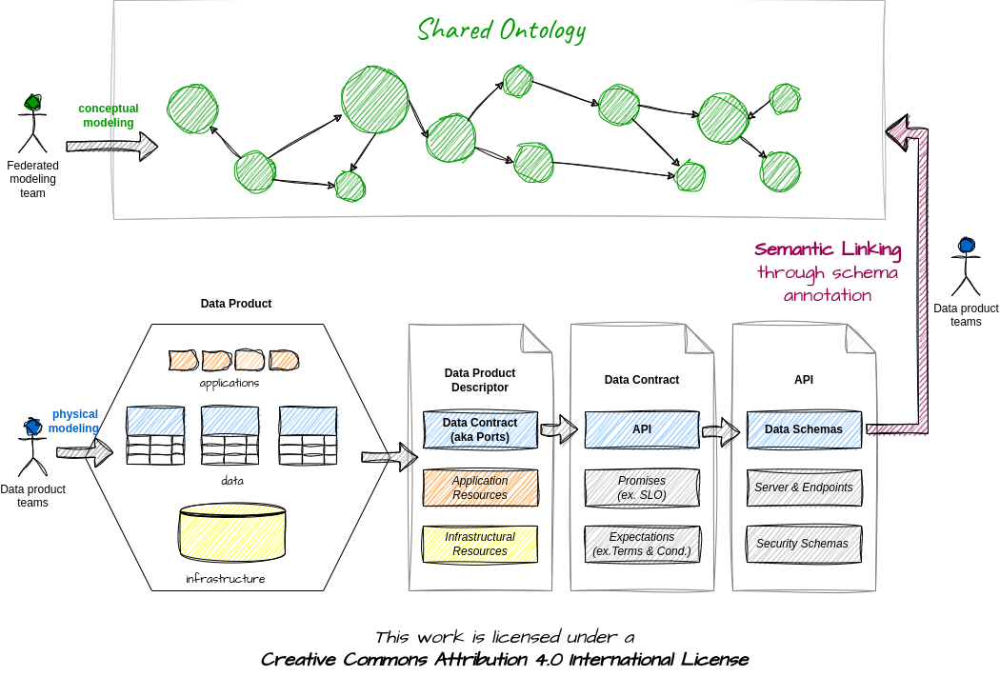

# Use cases-driven semantic modeling

## Post
From Knowledge GAP to Knowledge GRAPH...

🤓 To construct a **#knowledgegraph** (KG), it's crucial to establish a connection between physical data and the corresponding concepts within the shared corporate ontology. This process of **#semanticLinking**, within a federated operational model, should be decentralized to the data product teams rather than being centrally managed by the modeling team.

👉 Let's see how:

🔵 When a data product team introduces a new data product, they must describe it through a descriptor file that includes all the metadata mandated by the central governance team

🔵 Among these metadata, there are generally those related to the ports through which a data product exposes its data and functionalities. These metadata are publicly accessible and constitute the interface of the data product, also called **#datacontracts**

🔵 Output ports are the ports used by a data product to expose the produced data to its consumers. The data contract associated with an output port can contain various types of metadata. It typically always includes the schema of the exposed data

🔵 The schema of the exposed data can be encoded in various formats. The most common ones are JSON, AVRO, and Protobuf. In addition to describing the data structure, all these formats can be easily annotated with various types of metadata

🔵 Semantic links can be directly included as an annotation within the schema to indicate the concept/attribute to which a schema/field refers in the shared ontology. The value of the annotation is nothing but the URI of the referenced concept/property.

🔵 During the deployment of the data product, the CI/CD procedure can validate these semantic annotations and trigger a process to add the reference to the factual data exposed by the port to the KG
[#TheDataJoy](https://www.linkedin.com/feed/hashtag/?keywords=thedatajoy) **#datamodeling #dataproducts #datamesh**

## Image

[draw.io](https://app.diagrams.net/) source of the image is available [here](../images/008-semantic-linking.drawio) 

## Follow the conversation

🔵 [Linkedin post](https://www.linkedin.com/feed/update/urn:li:activity:7124807501220356096/)
