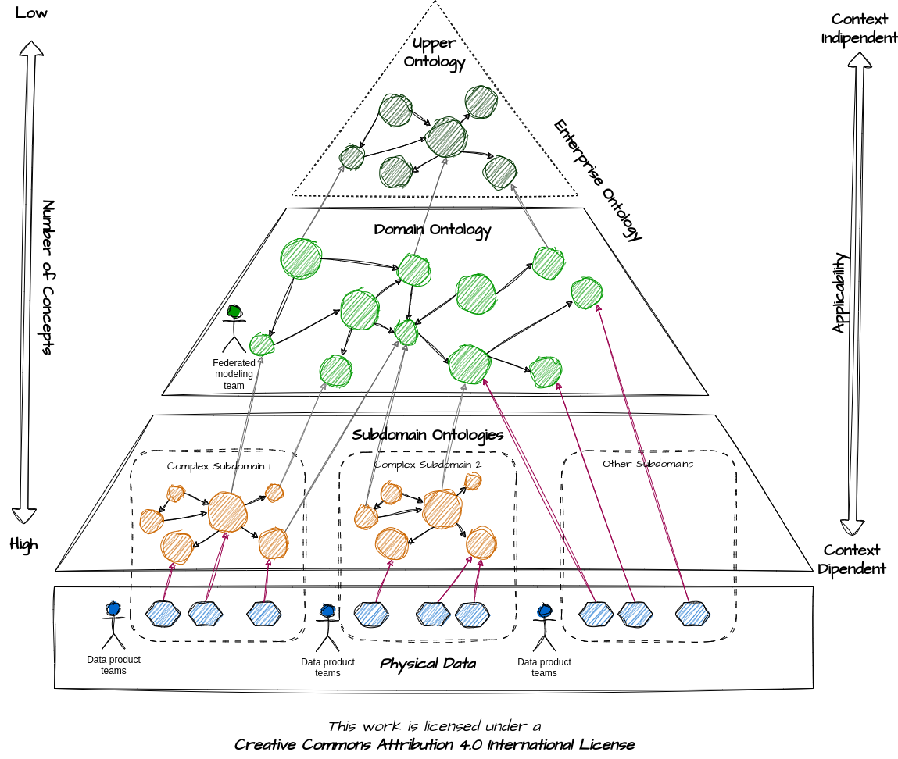

# Ontology Layers

## Post

🗺 An **#ontology** is like a map for navigating your data.

😵 No one needs a map displaying all conceivable information about a specific territory simultaneously; that would be overwhelming. This is why maps selectively showcase information based on their purpose and desired level of detail.

Similarly, ontologies should be structured in layers to facilitate their use and evolution over time. Let's see the key ones:

🔴 Upper Ontology: This is the top-level ontology composed of general concepts (e.g., Person) shared across all lower-level ontologies.

🔴 Domain Ontology: (e.g., Customer): This ontology provides a high-level description of key concepts within the company's business domain (e.g., Customer).

🔴 Subdomain Ontologies: These are specialized ontologies tailored for particularly complex subdomains. They expand upon concepts from the domain ontology to fine-tune them for the specific subdomain context (e.g., Direct Customer, Distributor).

Such an ontology layered structure can be constructed using top-down, bottom-up, or inside-out approaches, each with pros and cons.

🤓 What's your approach to ontology engineering?

[#TheDataJoy](https://www.linkedin.com/feed/hashtag/?keywords=thedatajoy) **#datamodeling**

## Image

[draw.io](https://app.diagrams.net/) source of the image is available [here](../images/009-ontology-layers.drawio) 

## Follow the conversation

🔵 [Linkedin post](https://www.linkedin.com/feed/update/urn:li:activity:7126215814571016193/)
