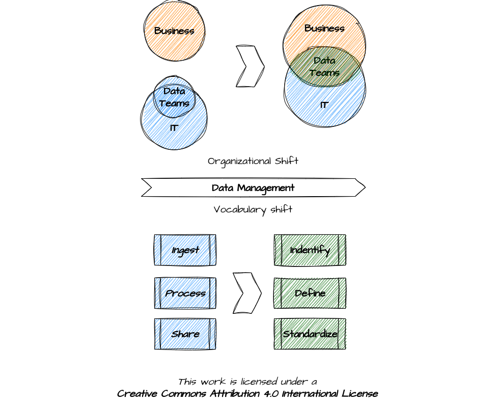

# Data Vocabulary

## Post
Are your data products interoperable? At which level? 🤔

In a modular architecture built through the composition of data products, striking a balance between the local independence of individual components and the global need for their interoperability is crucial.

Without proper equilibrium, the system is at risk of going out of control (chaos catastrophe).

Different levels of interoperability are possible...

🔗 Syntactic Interoperability: Ensuring data products speak the same language by focusing on data format and structure. It's like making sure everyone's reading from the same data playbook. Defining policies and rules to guarantee syntactic interoperability is a responsibility of the federated governance team.

💼 Semantic Interoperability: Taking it up a notch! Beyond structure, it's about ensuring a shared understanding of data meaning. No more data misinterpretation – it's all about a unified understanding of the data's semantics. Defining a unified semantic model is a responsibility of the federated modeling team.

In the world of data management, both syntactic and semantic interoperability play pivotal roles. It's not just about formatting; it's about speaking the same language and truly understanding the message.

[#TheDataJoy](https://www.linkedin.com/feed/hashtag/?keywords=thedatajoy) **#datamodeling #datamanagement**

## Image

[draw.io](https://app.diagrams.net/) source of the image is available [here](../images/011-data-vocabulary.drawio) 

## Follow the conversation

🔵 [Linkedin post](https://www.linkedin.com/feed/update/urn:li:activity:7131313977480900608/)
