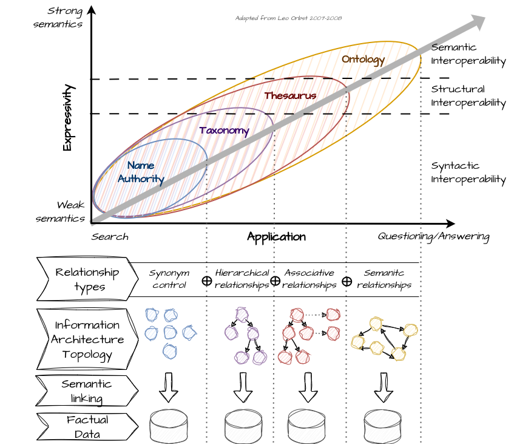

# Knowledge organization System (KOS)

## Post

There is no Artificial Intelligence (AI) without Information Architecture (IA).

📊 Data becomes information when it is organized and contextualized through metadata.

🧠 Information becomes knowledge when it is structured through meaningful relationships.

🔗 The type of relationships used to connect information determines the topology and semantic richness of the information architecture.

🌐 The more semantically rich the information architecture is, the higher the level of interoperability between the managed data and enabled use cases.

🚀 To fully harness the potential of AI, particularly generative AI, it is essential to have a rich information architecture based on **#ontologies** linked to factual data, forming a **#knowledgegraph.**

[#TheDataJoy](https://www.linkedin.com/feed/hashtag/?keywords=thedatajoy) 

## Image

[draw.io](https://app.diagrams.net/) source of the image is available [here](../images/015-kos.drawio) 

## Follow the conversation

🔵 [Linkedin post](https://www.linkedin.com/posts/andreagioia_ontologies-knowledgegraph-thedatajoy-activity-7151575980153712641-TeZW)

