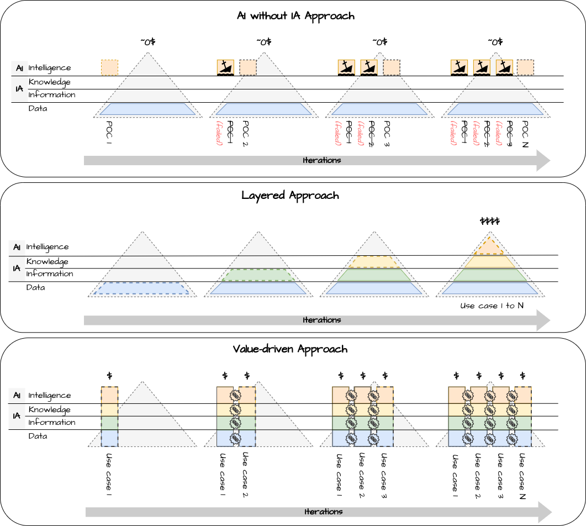

# Value driven approach

## Post

"We are currently too busy preparing the data to feed into AI applications to work on information architecture" 😯 

🤔 What if you are too busy precisely because you don't have an information architecture?

It is not possible to fully leverage the potential of AI without a mature Information Architecture (IA). But what are the approaches to implementing such an architecture? 

🤓 The Information Architecture is built on top of data to facilitate its use and composability in an unbounded set of use cases. It organizes and manages information and knowledge. Since information is defined from data by adding metadata, and knowledge is defined from information by adding relationships, information architecture is often represented as the intermediary layers of a pyramid, with data at the base and applications at the top.

There are three possible approaches to building this pyramid:

1️⃣ AI without AI Approach:
Starting from the top (AI) and ignoring the intermediate layers (AI). This approach usually does not yield significant results. Low-quality and non-interoperable data generally lead to POCs that produce poor results and are challenging to put into production. ❌

2️⃣ Layered Approach:
Starting from the base and gradually building up each layer. While this approach is resource-intensive and carries inherent risks, it is widely embraced. There's a common belief that managing metadata (information layer) is futile until the data platform is fully matured. Similarly, defining the conceptual model (knowledge layer) might seem premature with limited metadata. Generally, due to internal pressures, this approach reverts to the previous one. 💸

3️⃣ Value-Driven Approach:
Starting from the top by selecting use cases and then developing in the underlying layers all the necessary components to support the prioritized use cases. In this approach, the pyramid is built incrementally based on use cases. It is an approach that not only reduces time to value but, if supported by comprehensive governance policies, also enables the reuse of components across different layers in subsequent iterations. 🚀

Which approach do you follow?

[#TheDataJoy](https://www.linkedin.com/feed/hashtag/?keywords=thedatajoy) 

## Image

[draw.io](https://app.diagrams.net/) source of the image is available [here](../images/017-value-driven.drawio) 

## Follow the conversation

🔵 [Linkedin post](https://www.linkedin.com/posts/andreagioia_thedatajoy-activity-7154107725344342017-tESH)

