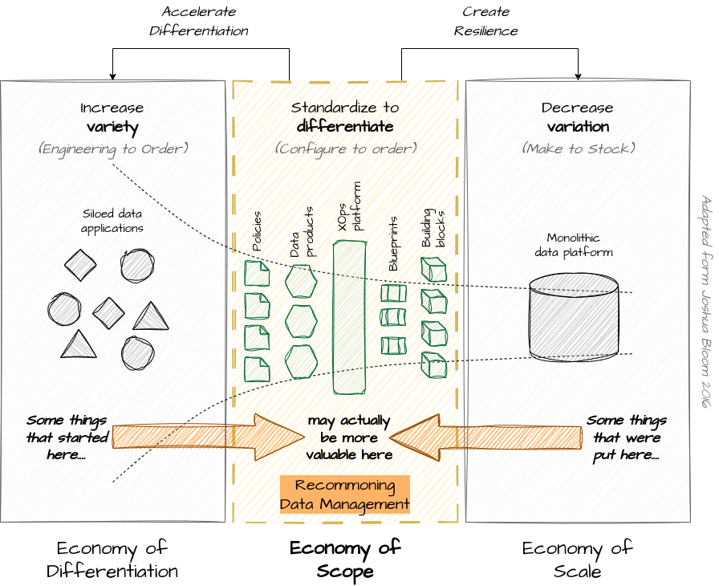

# Recommoning

## Post

What recommoning is and why does it matter for data management?

📖 Recommoning is the practice of reclaiming a previously privatized, enclosed, or commodified resource deemed essential for collective survival.

Companies operate under a bipolar model ⏪ ⏩ 
⏪ On one side, business functions operate in a differentiation economy where key elements are autonomy and agility. The goal is to adapt to external demand by increasing outcome variability as much as possible to maximize competitiveness in the market. 
⏩ On the other side, support functions operate in an economy of scale where key elements are control and planning. The goal is to adapt to internal demand by reducing variances in outputs as much as possible to maximize efficiency in the use of shared resources. 

⏪ ⏩ Data management reflects this bipolar structure. Monolithic data platforms managed by central IT, efficient but slow to evolve, coexist with siloed data solutions managed by business units, effective but less interoperable. 

🔄 Data recommoning means bringing data management back into a scope economy, where business units and central IT can collaborate to share easily reusable and composable standard data-related resources to ensure the best mix of agility and control. 

🤓 Data is a non-depletable asset. Therefore, managing data according to scale economy principles designed to optimize the use of consumable resources makes little sense. Similarly, data assets gain value as they are used. Therefore, managing data according to differentiation economy principles designed to optimize agility over reuse makes little sense. Due to its inherent nature, data is a shared resource that ought to be collectively managed by both IT and Business. This management should take place within a neutral space that transcends principles of differentiation and scale economy, moving towards more inclusive and contextually relevant models of data governance rooted in practices of commoning.

🌐 Data belongs to all within an organization, and therefore, must be managed by all. Recommoning is an ongoing optimization of data and data management capabilities. Our challenge is to find new practices for establishing negotiation, collaboration, cooperation, and coordination to facilitate optimal governance of data as a common resource. 🤝

[#TheDataJoy](https://www.linkedin.com/feed/hashtag/?keywords=thedatajoy) **sociotechnicalsystems**

## Image

[draw.io](https://app.diagrams.net/) source of the image is available [here](../images/018-recommoning.drawio) 

## Follow the conversation

🔵 [Linkedin post](https://www.linkedin.com/feed/update/urn:li:activity:7131313977480900608/)

