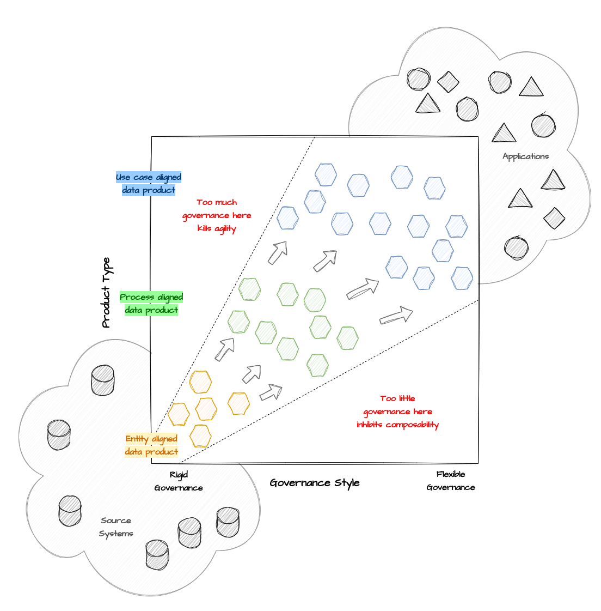

# Governance styles

## Post

What is the best approach to **#datagovernance** for **#dataproduct** centric architectures?

👍 Implementing rigid governance promotes standardization and composability of data products. 

👎However, it simultaneously increases development costs and reduces business agility.

🔴 With overly rigid governance, there is a risk that many teams may choose to avoid adopting the new data product-centered approach due to reduced agility and continuing to develop siloed data solutions.

🔴 On the other hand, with very flexible governance, it is easier to get everyone on board, but there is a risk of having a high number of low-quality and less reusable data products that overshadow high-quality products and the overall benefits of the entire data product-centric approach.

🤔 So, how do we find the right trade-off? It's important to understand that one size does not fit all. The level of governance, whether more or less rigid, should be defined based on the type of data product. 

In general, data products can be divided into three main types:

1️⃣ Entity Aligned: These are core data products from which most others derive. They are generally associated with entities (customer, product, etc.) managed by business capabilities involved in the organization's core processes. Governance for these products should be strict to promote composability in favor of agility.

2️⃣ Process Aligned: These are data products that connect data from different entities involved in key business processes for the organization. The way data is combined depends on the specific business process. Unlike entities (customer, product, etc.), which tend to be stable over time, processes can vary more frequently (e.g., order management, customer support, etc.). Governance for these products should balance composability and agility, accepting a lower level of standardization for greater adaptability to changing processes.

3️⃣ Use Case Aligned: These include all data products associated with specific use case classes. They are built to meet the needs of specific teams and have limited interest outside of them. Governance for these data products should be lightweight to favor agility over standardization.

🤓 In summary, it is crucial to classify data products correctly and then apply the right amount of governance, neither too much nor too little. Applying the same governance style to all types of data products inevitably results in too much governance for some products and too little for others. 

What do you think?

[#TheDataJoy](https://www.linkedin.com/feed/hashtag/?keywords=thedatajoy) **#dataProducts**

## Image

[draw.io](https://app.diagrams.net/) source of the image is available [here](../images/019-governance-styles.drawio) 

## Follow the conversation

🔵 [Linkedin post](https://www.linkedin.com/posts/andreagioia_datagovernance-dataproduct-thedatajoy-activity-7159234314491068416-EK71)

