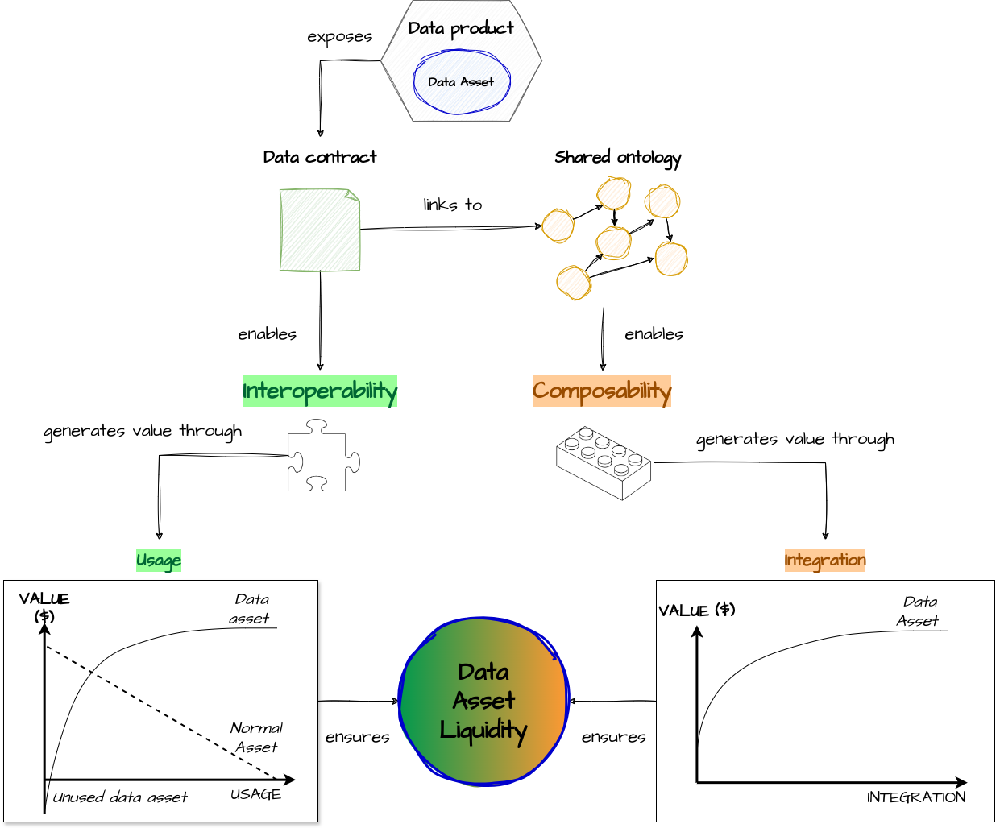

# Semantyc Layer

## Post

Data product interoperability is not enough, composability is also needed

🌊 A **#dataProduct** makes a data asset liquid. The liquidity of a data asset is defined as the ease with which it can be reused and integrated with other data assets. The more reusable and integrable a data asset is, the more liquid it is. The more liquid a data asset is the greater its value 💵 

🧩 **#interoperability**, guaranteed through **#dataContracts**, enables ease of reuse. However, an interoperable data product is not necessarily composable. 

🎶 **#composability** occurs when an interoperable data product can be integrated with other data products in different combinations. If a product can be reused but always within the same predetermined configuration, it is interoperable but not composable. 

🤓 For example, a puzzle piece is interoperable but not composable because it fits with others only in a specific configuration. A Lego block, on the other hand, is both interoperable and composable.

✅ For truly composable data products, seamless integration at the semantic level is crucial. This can be achieved by adopting a shared conceptual model, or **#ontology**, that allows data products to connect their managed data assets to a common semantic. 

[draw.io](https://app.diagrams.net/) source of the image is available [here](../images/021-composability.drawio) 

## Follow the conversation

🔵 [Linkedin post](https://www.linkedin.com/posts/andreagioia_dataproduct-interoperability-datacontracts-activity-7164280389186863104-8v4i)
